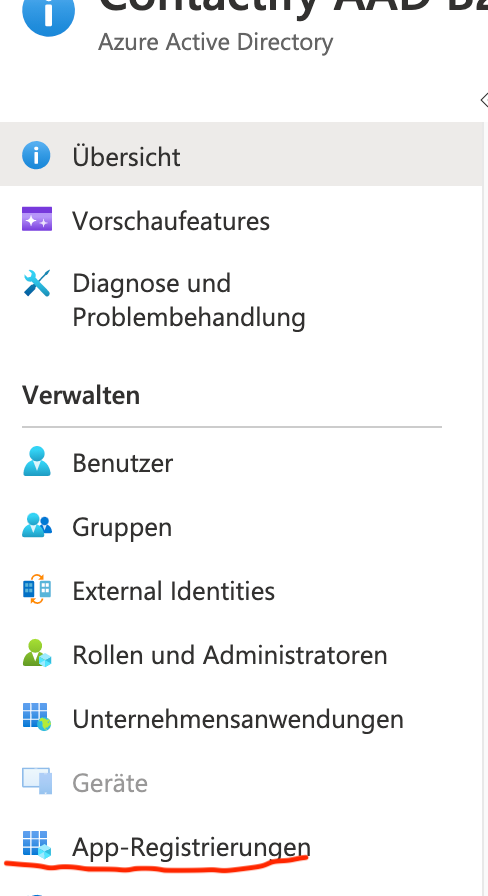
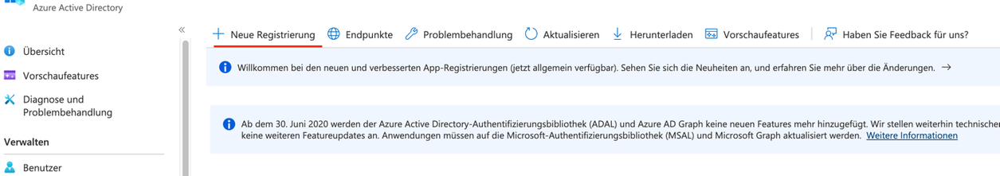
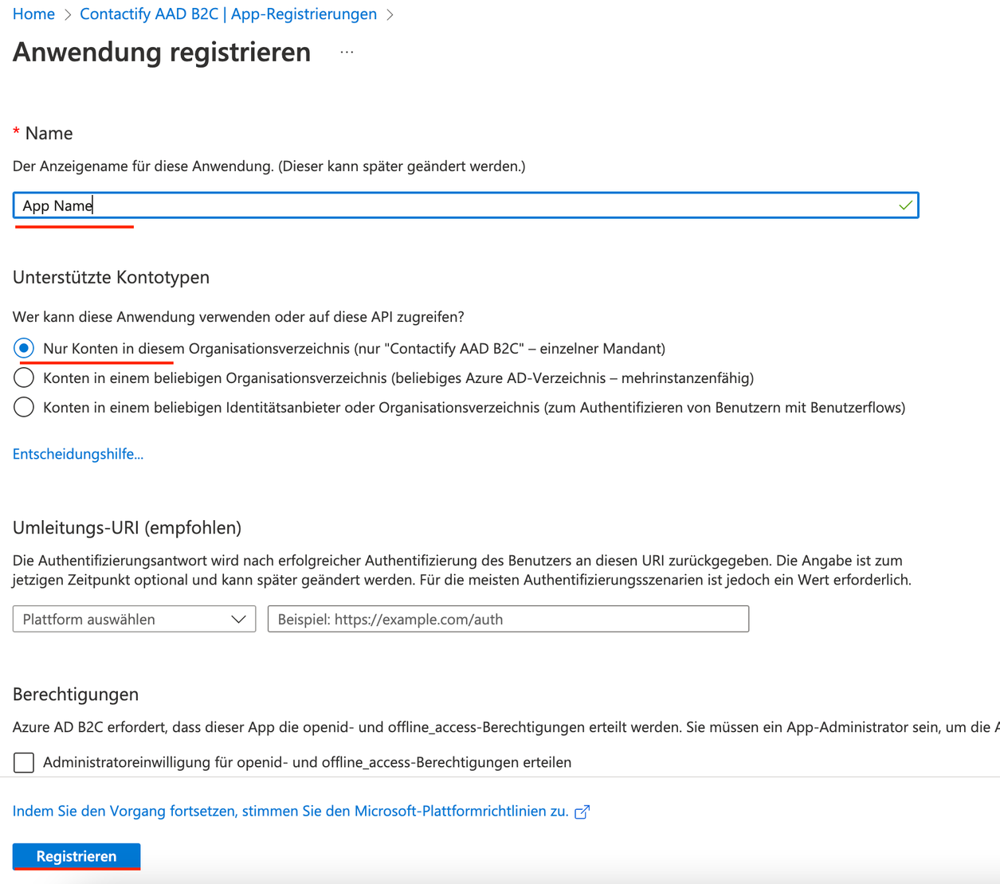
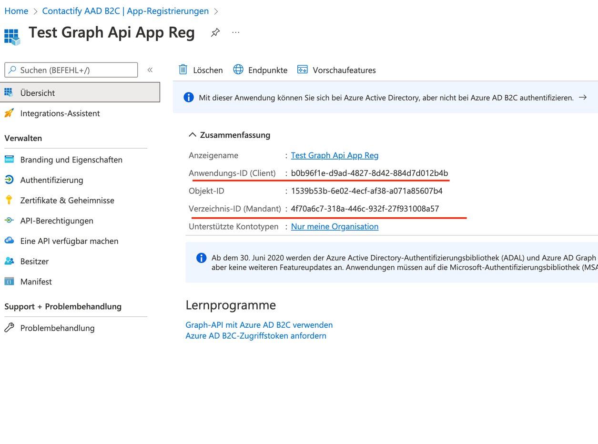
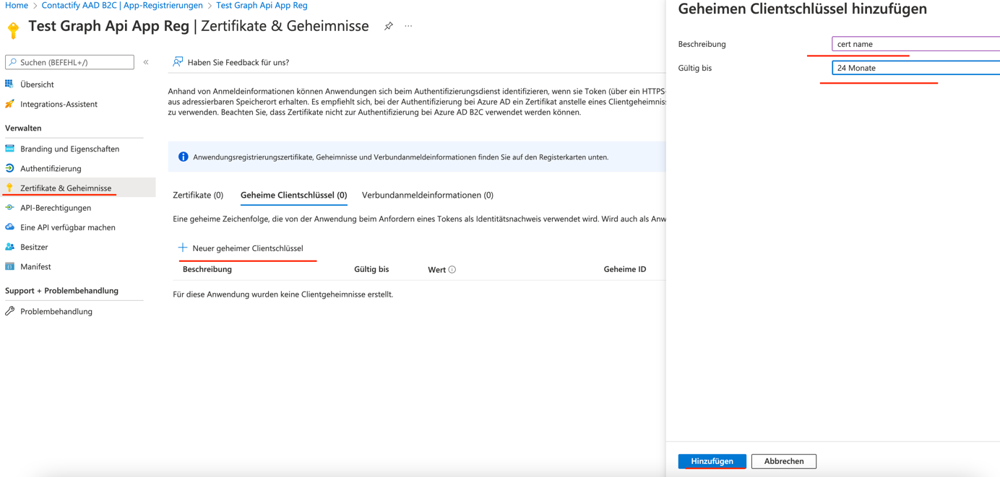
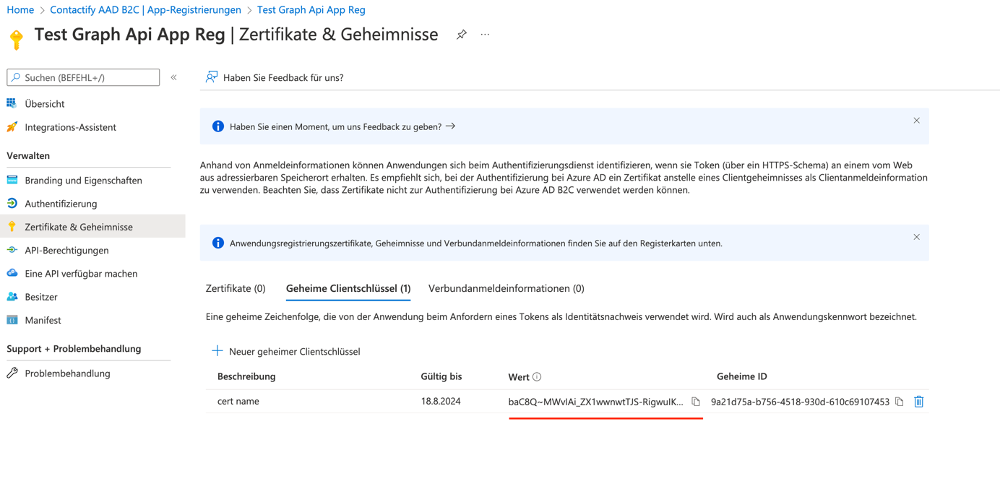
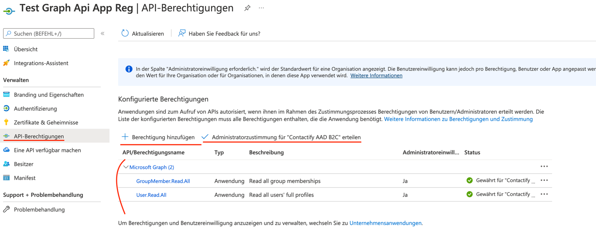

# User Sync – Azure Graph API

With the Azure Graph API integration, users can be automatically managed: that means created (incl. all contact data and picture), updated and deleted.

## Instructions
1. Open Azure Active Directory
2. Add App Registration

    Go to App Registrations  
    

    Create Registration  
    

    App Registration  
    
3. Open created app registration
4. Copy client id and tenant id and provide to Contactify  
    
5. Open Certificates and Secrets and add a new certificate  
    
6. Copy certificate value after creation and provide to Contactify  
    
7. Open Api Permissions and add `GroupMember.Read.All` and `User.Read.All` permissions and grant admin consent  
    
8. Create two azure ad groups:  
    
    - group for all contactify platform users
    - group for contactify platform administators

    All the users in the admins group should be members of the platform users group
9. Provide the group ids to Contactify.