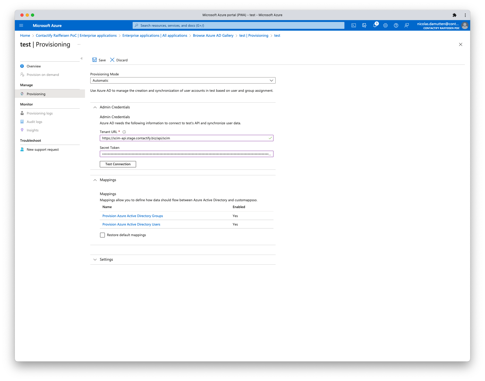
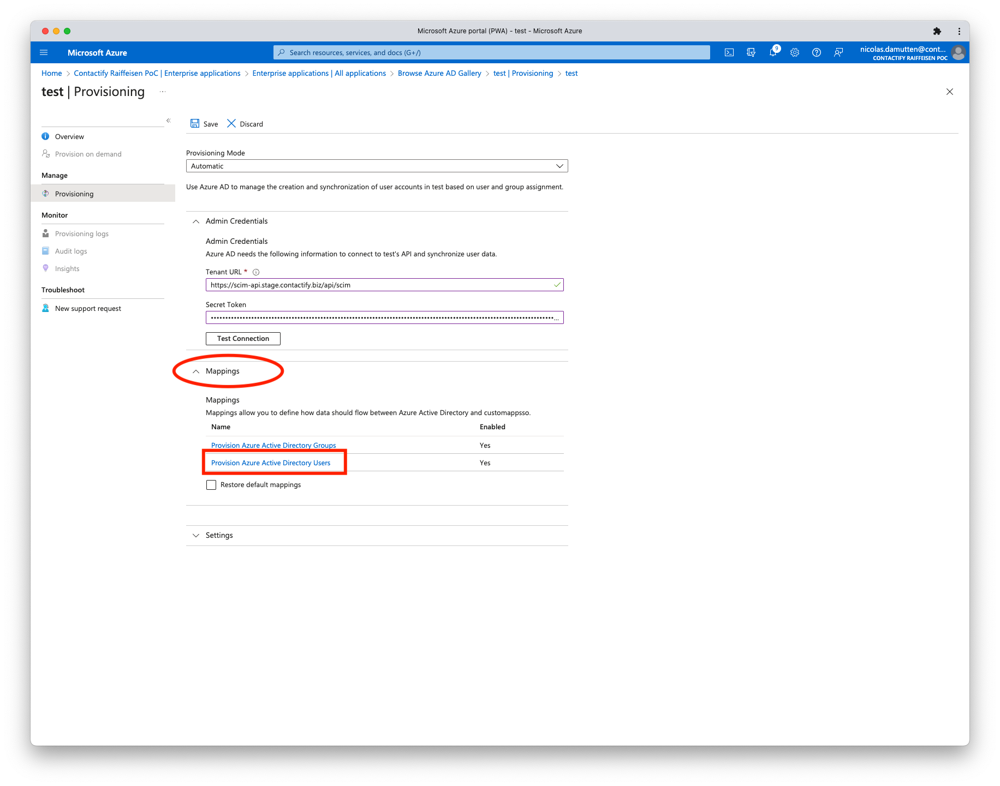
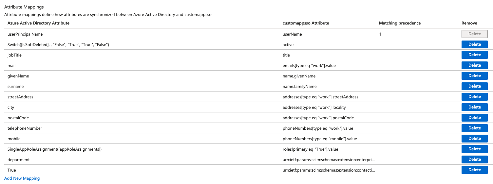
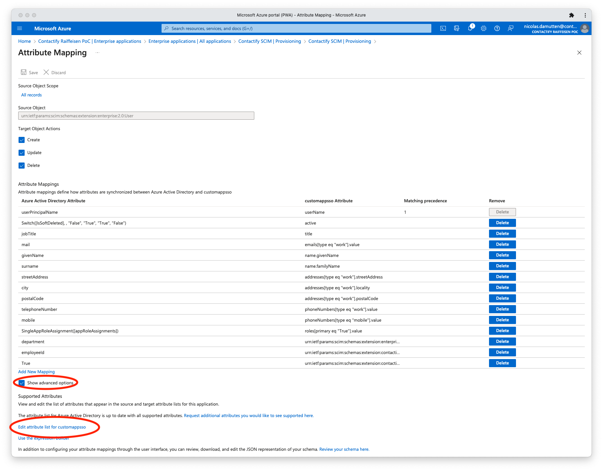

# User Sync – SCIM

With SCIM, users can be automatically managed: that means created (incl. contact data), updated and deleted. It is even posible to control order of physical business cards.

## Instructions for Azure AD
1. Open Azure Active Directory
2. Add Enterprise Application (if not already done)
3. Select Provisioning
4. Select Provisioning again
5. Select Automatic mode, add tenant URL and Secret Token and click on "Test Connection"  
    
6. Click on Mappings and select "Provision Azure Active Directory Users"  
    
7. Set up similar to the following, mapping the fields you need. The full spec of attributes can be found here: https://scim-api.stage.contactify.biz/api/scim/Schemas  
      
    Azure Active Directory Attribute | customappsso Attribute | Matching precedence
    --- | ---| ---
    userPrincipalName | externalId | 1
    mail | userName |
    Switch([IsSoftDeleted],, "False", "True", "True", "False") | active |
    jobTitle | title |
    mail | emails[type eq "work"].value |
    givenName | name.givenName |
    surname | name.familyName |
    streetAddress | addresses[type eq "work"].streetAddress |
    city | addresses[type eq "work"].locality |
    postalCode | addresses[type eq "work"].postalCode |
    telephoneNumber | phoneNumbers[type eq "work"].value |
    mobile | phoneNumbers[type eq "mobile"].value |
    SingleAppRoleAssignment([appRoleAssignments]) | roles[primary eq "True"].value |
    department | urn:ietf:params:scim:schemas:extension:enterprise:2.0:User:department |
    True | urn:ietf:params:scim:schemas:extension:contactify:2.0:User:orderCard |

    The only field required on Contatify side is actually `userName`. All other fields are optional. If you use the recommended mapping listed above, `externalId` is required too, in order for Azure to be able to map the users.

    If you want to manage Roles (`SingleAppRoleAssignment([appRoleAssignments])`) via SCIM, please check the section below.

    In Order to add the contactify extension fields, click on "Show advanced options" and then "Edit attribute list for customappsso"

    

    There you can add all the fields you need from the following table (or the full spec mentioned above):
    Attribute | Type | Primary Key | Required | Multi-Value | Exact Case | Muatbility | Api Expression | Referenced Object Attribtue
    --- | --- | --- | --- | --- | --- | --- | --- | ---
    urn:ietf:params:scim:schemas:extension:contactify:2.0:User:uid | String | No | No | No | Yes | ReadWrite | - | -
    urn:ietf:params:scim:schemas:extension:contactify:2.0:User:externalCompanyId |String | No | No | No | No | ReadWrite | - | -
    urn:ietf:params:scim:schemas:extension:contactify:2.0:User:orderCard | Boolean | No | No | No | No | immutable | - | -
    urn:ietf:params:scim:schemas:extension:contactify:2.0:User:deliverCardToHeadquarters | Boolean | No | No | No | No | immutable | - | -
    urn:ietf:params:scim:schemas:extension:contactify:2.0:User:sendWelcomeEmail | Boolean | No | No | No | No | immutable | - | -

### Sync Regularity

Check Microsofts doc: https://learn.microsoft.com/en-us/entra/identity/app-provisioning/how-provisioning-works#provisioning-cycles-initial-and-incremental  
Als here: https://learn.microsoft.com/en-us/azure/databricks/administration-guide/users-groups/scim/aad#provisioning-tips

## Authentication

The authentication is done via a long lived bearer token (https://learn.microsoft.com/en-us/azure/active-directory/app-provisioning/use-scim-to-provision-users-and-groups#handling-endpoint-authentication). The token is generated by Contactify and will be provided to you. It is valid for a specific tenant and can be used for all users of that tenant.

The token has a lifetime of 182 days, so it needs to be renewed every 6 months. Contactify has a reminder system in place and will reach out to you before the token expires.

## Role Management

The SCIM API also allows for managing Roles directly in Azure. For that you need to add the Following App Roles to your Enterprise Application.
Please note, Contactify only supports one Role per User. If you add more than one Role, the primary one will be used.
Once you configure SCIM to manage Roles, you can no longer manage them via the Contactify Admin UI, as they will be overwritten by SCIM.

Display Name | Value | Description | Corresponding Role in Contactify
--- | --- | --- | ---
Tenant Admin | Admin | Tenant admins have the ability to edit all companies and data of all users in those companies. | Tenant Administrator
Company Admin | CompanyAdmin | Company admins have the ability to edit their own company and all users in that company. | Company Administrator
User | User | A Company User has access to his own data, but can't manage any company data. | Company User